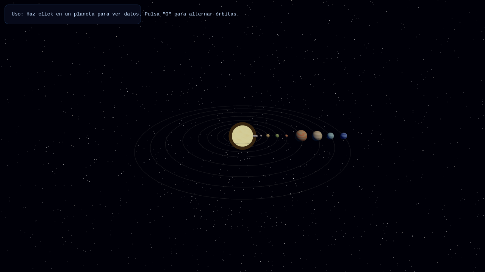

# SafeVibe CLI

> Código que compila no es código seguro.

Los LLMs escriben código plausible, no código correcto. Inventan paquetes que no existen, dejan `eval()` donde no debe haberlo, y producen archivos que compilan perfecto y no hacen nada.

SafeVibe es un filtro. La IA genera, SafeVibe verifica, tú recibes solo lo que pasó.



---

## Qué hace, exactamente

El código generado nunca llega directo a tus manos. Pasa por un sandbox temporal y cuatro capas de verificación. Si alguna falla, el error se le devuelve a la IA para que lo corrija — en silencio, sin que tengas que intervenir.

**1. Análisis estático de seguridad**
Bloquea `eval()`, `exec()`, `os.system()`, `child_process.exec()`, `shell=True`, `dangerouslySetInnerHTML` y `@ts-ignore` (engañar al compilador no es arreglar el código).

**2. Verificación de dependencias**

Cada paquete importado se consulta contra el registro de **npm** o **PyPI** en tiempo real. Si el LLM alucinó una librería, se detecta antes de que llegue a tu `package.json`.

Pero existir en el registro no basta. El ataque real es más sutil: un atacante registra `reqeusts` (una transposición de `requests`) o `lodahs` (de `lodash`), publica un payload malicioso, y espera a que un LLM alucine ese nombre y alguien lo instale. Se llama *slopsquatting*.

SafeVibe compara cada dependencia contra una lista de paquetes populares usando **distancia de Damerau-Levenshtein**, que cuenta la transposición de dos letras adyacentes como una sola edición — el typo más común en este tipo de ataque. Distancia 1 se bloquea; distancia 2 genera una advertencia. Las variantes legítimas (`lodash-es`, `fs-extra-promise`) y los paquetes con scope (`@types/react`) se excluyen para evitar falsos positivos.

Esta capa importa más de lo que parece. Cuando un modelo inventa un nombre de paquete, un atacante puede registrarlo y esperar a que alguien lo instale — se llama *slopsquatting*. Verificar contra el registro lo corta de raíz.

**3. Compilación real**
TypeScript pasa por `tsc --noEmit --strict`. Python por `py_compile`. Sin atajos, sin simulación: si no compila, no pasa.

**4. Validación visual (para simulaciones 3D)**
Aquí es donde SafeVibe va más allá del análisis estático. El HTML generado se carga en Chromium headless con Playwright, y se verifica que **realmente renderice**: se cuentan los meshes recorriendo el grafo de escena, se hace pixel readback del canvas WebGL para detectar pantalla negra, y se capturan errores de consola y runtime. Resultado por debajo de 70/100 → se rechaza y se corrige.

Un archivo que compila puede seguir siendo una pantalla negra. Esta capa lo atrapa.

---

## Bucle ReAct

Cuando una capa rechaza el código, el error se sanitiza y se reenvía al modelo con instrucciones de corrección. El ciclo se repite hasta 5 veces para seguridad y compilación, y hasta 2 veces para validación visual.

Tú solo ves el resultado final. Si nada pasó las verificaciones, SafeVibe te lo dice — no te entrega código roto fingiendo que funciona.

---

## Instalación

Requiere Node.js 20+.

```bash
git clone https://github.com/SantiCruz650/safevibe-cli.git
cd safevibe-cli
npm install
npx playwright install chromium
```

Configura tu API key como variable de entorno (nunca en un archivo):

```bash
cp .env.example .env
# edita .env con tu key
export GROQ_API_KEY="tu_key_aqui"
```

Ejecuta:

```bash
npm run dev
```

---

## Proveedores de IA

SafeVibe no está casado con ningún modelo. Todos los proveedores implementan la misma interfaz `AIProvider`:

| Proveedor | Estado |
|---|---|
| Groq Cloud | Por defecto (`openai/gpt-oss-120b`) |
| Anthropic | Soportado |
| OpenRouter | Soportado (también visión) |
| Ollama | Local, sin API key |
| NVIDIA NIM | Implementado |

Cambiar de modelo es cambiar un string en `config.json`.

---

## Arquitectura

```
src/
├── core/secureGenerator.ts    Orquestador del pipeline
├── validators/
│   ├── securityAnalyzer.ts    Heurísticas + verificación npm/PyPI
│   ├── typescriptValidator.ts tsc --noEmit --strict
│   ├── pythonValidator.ts     py_compile
│   └── visualValidator.ts     Playwright + Chromium headless
├── ai/providers/              Patrón adaptador, 5 proveedores
├── system/fileManager.ts      Sandbox temporal aislado
└── simulations/               Templates Three.js con datos reales de NASA
```

La UI es una TUI construida con [Ink](https://github.com/vadimdemedes/ink) (React para terminal).

---

## Simulaciones 3D

SafeVibe puede generar simulaciones interactivas en Three.js. El sistema solar de arriba salió de un prompt de una línea: los datos orbitales son reales, las texturas son procedurales, y el conjunto pasó las cuatro capas de validación antes de abrirse en el navegador.

No es el producto — es la prueba de que la validación llega hasta el resultado visible, no solo hasta el compilador.

---

## Tests

```bash
npm test
```

Suite de regresión sobre el `SecurityAnalyzer`: verifica que bloquee `eval` y `os.system`, que atrape typosquatting y paquetes alucinados, y que deje pasar dependencias legítimas.

---

## Roadmap

**Distribución vía `npx safevibe`.** Clonar un repo es demasiada fricción. La herramienta debe correr sin instalar nada.

**Ampliar la cobertura de tests.** La suite actual cubre el `SecurityAnalyzer`. Faltan los validadores estructurales y el pipeline completo.

**Integración continua.** Correr `npm test` en cada push con GitHub Actions.

---

## Restricciones de diseño

- Sin `npx` en subprocesos: se usan paths directos a `node_modules/.bin/` (compatibilidad con Linux Crostini).
- Sin emojis en el código fuente.
- Optimizado para hardware modesto (4–8 GB RAM). Se desarrolló íntegramente en una Chromebook.

---

## Licencia

MIT
